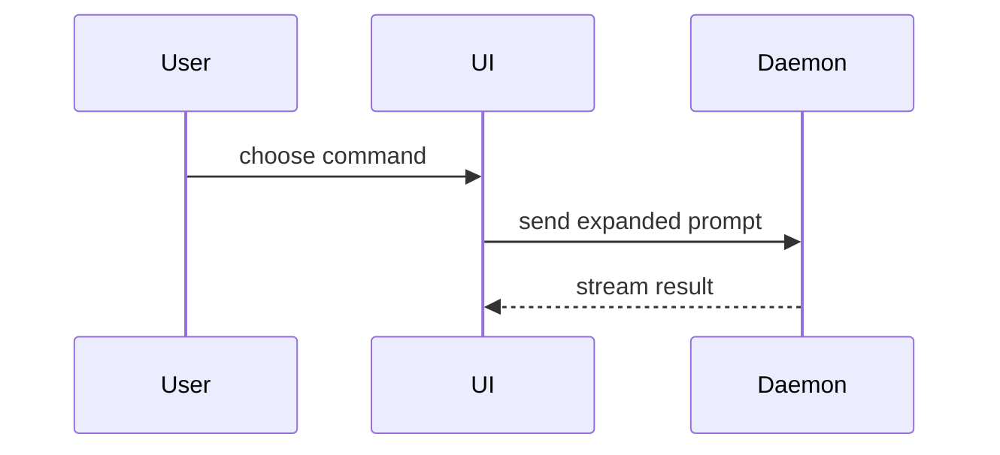

# Write a PR title and description

If the repository keeps its own PR template (`.github/pull_request_template.md`, or one under `.github/PULL_REQUEST_TEMPLATE/`) or documents a title convention, that wins; use the rest of this skill only for what it leaves open. Otherwise, use this template for the PR body:

```markdown
## Summary

<diagram, diff-sketch, or tree>

## Evidence

- **Before:** <screenshot/output/failing test run>
  **After:** <screenshot/output/passing test run>

## Merge Danger

**Door:** one-way or two-way
**Blast Radius:** <potential ramifications of merge>

Closes <ISSUE>. Part of <PARENT-ISSUE>.
```

> **Tracker:** the tracker steps use whatever issue tracker this session can reach (an
> issue-tracker MCP server or CLI the host has connected). The issue key format comes from the
> project map in `AGENTS.md` or from the ids already in the branch's commits. No tracker? Skip
> step 2 and drop the issue id and the closing line everywhere.

## Sections

Skip all preambles and keep prose brief. Use the domain language from the project's glossary.

### Summary

Pick the smallest view that makes the key point clear.

- Show logic or an algorithm as pseudocode:

```text
on(save)
  if content is unchanged
    return cached result
  write new content
  return fresh result
```

- Show runtime control flow as a call tree:

```text
submitForm
  createSession
    persistPrompt
    launchAgent
  navigateToSession
```

- Show UI structure as a component tree, including state and module boundaries that matter:

```tsx
<SessionPage> (apps/example/src/routes/session.tsx)
  useSessionEvents()
  <SessionToolbar>
    <RunSkillButton> (packages/ui)
```

- Show file responsibility or a broad refactor as a shallow file tree:

```text
src/
├── commands/       # parses user actions
├── sessions/       # owns session state
└── transport/      # sends API requests
```

- Show component interaction, control flow, or data flow with Mermaid:



- Use `diff` when the point is what changes and the surrounding shape already exists. Match the diff shape to the topic.

For a component change:

```diff
 <SessionPage>
   useSessionEvents()
   <SessionToolbar>
+    <RunSkillButton />
   <SessionTimeline>
+    <SkillResultCard />
```

For a file-layout change:

```diff
 src/
 ├── commands/
+│   └── show-me.ts       # expands the slash command
 ├── sessions/
-└── transport.ts
+└── transport/
+    ├── client.ts
+    └── stream.ts
```

For a call-tree or call-stack change:

```diff
 submitForm
   createSession
     persistPrompt
+    expandSkillMention
     launchAgent
-  navigateToSession
+  navigateToSession
+    subscribeToEvents
```

For a state or control-flow change:

```diff
 on(save)
-  write content
+  if content is unchanged
+    return cached result
+  write new content
+  invalidate cache
```

- Show the whole block when most of it is new, when omitted context would hide ownership or order, or when the user needs a copyable target shape:

```ts
function expandSkill(command: string): string {
  const skillName = command.slice(1);
  return `use the ${skillName} skill`;
}
```

#### Guidance

Place each visual next to the short text it supports. Keep only the calls, files, props, states, and boundaries needed to answer the user's current question or the options to resolve the current discussion point.

You may use one of these, you may use several, it is unlikely you will use all of them. Use your judgement and don't overwhelm the user.

### Evidence

Concrete evidence that the change works. Show a before and after.

Screenshots are S-tier, when the environment is set up for it and the change is visual.

Execution-based evidence is A-tier. Test results, console output. Show the exact test that now fails and passes, using pseudocode.

### Merge Danger

Describe whether it's a one-way or two-way door. You can walk back through two-way doors, but not one-way doors. A PR that is cheap to roll back is lower risk. Changes that involve destructive actions or hard-to-reverse decisions are one-way doors.

The blast radius is the potential impact or scope of the changes introduced by this PR. Consider all possibilities. Examples are layout shift, breakages for consumers, mobile responsiveness, etc.

## Workflow

1. **Gather context** (run together):

   The trunk is the repository's default branch (the project map in `AGENTS.md` names it); substitute it below.

   ```sh
   git branch --show-current                              # MUST NOT be the trunk; abort if it is
   git log <trunk>..HEAD --pretty=format:'%h %s%n%b'         # commits on this branch
   git diff <trunk>...HEAD --stat                            # changed files + churn
   gh pr view --json number,url,state,title,body 2>/dev/null   # non-zero exit = no PR yet
   ```

   Read the diff for the key files (`git diff <trunk>...HEAD -- <path>`); on large diffs lean on `--stat` plus the important files.

2. **Ground in the tracker (read-only).** Grep branch + commit subjects for issue ids in the project's key format (e.g. `[A-Z]+-\d+`, or `#\d+` on GitHub Issues). If found, fetch the issue and its parent for the problem, the intent, and the canonical link. Read only: never create or modify an issue here. No id: derive from diff + commits.

3. **Draft title + body together.** Title per [Title format](#title-format); body to a temp file (`mktemp`) per the template and [Sections](#sections), obeying [Body rules](#body-rules). For an existing PR, treat the current title and body as a draft, not a constraint.

4. **Create or update the PR.** Show the drafted **title** and **body** + the exact `gh` command; quick confirm before running (notifies reviewers + CODEOWNERS) unless told to just do it.

   ```sh
   git rev-parse --abbrev-ref --symbolic-full-name @{u} 2>/dev/null || git push -u origin "$(git branch --show-current)"
   # update existing; pass --title only if it changes:
   gh pr edit <number> --body-file <tmp> [--title "<drafted title>"]
   # or create new:
   gh pr create --base <trunk> --title "<drafted title>" --body-file <tmp>
   ```

   Report the PR URL.

## Title format

Communicate *what changed and why* at a glance, specific enough that a reviewer can predict the diff. GitHub auto-appends ` (#NNNN)` on merge; do not write it yourself.

```
<type>(<scope>): <summary> (<ISSUE>)
```

- **`<type>`**: dominant intent of the diff.

  | Type       | Use for                                     |
  | :--------- | :------------------------------------------ |
  | `feat`     | New feature or capability                   |
  | `fix`      | Bug fix                                     |
  | `refactor` | Code restructuring with no behaviour change |
  | `docs`     | Documentation only (includes ADRs)          |
  | `test`     | Adding or updating tests                    |
  | `chore`    | Build config, dependencies, tooling         |
  | `perf`     | Performance improvement                     |

  Mixed diff: pick the user-visible win, mention the rest in the Summary.
- **`<scope>`**: optional but usually present. Lowercase kebab, naming the component or area touched. Take the scopes the project already uses from recent PR titles (`gh pr list --state merged --limit 30`). Multi-scope `(api,db)` only when both are non-trivial. Drop the scope when the change is repo-wide.
- **`<summary>`**: imperative present tense, lowercase first word, no trailing period. Proper nouns keep their case (`PostgreSQL`, `GitHub`, `ADR-0014`); double quotes around identifiers are fine.
- **`(<ISSUE>)`**: most specific tracker id (slice over spec); drop entirely if none. Follow-ups with no ticket: `(follow-up to #NNNN)`.

**Lint:**

- No em-dash (`—` / `–`). Hyphen, colon, or rephrase.
- No trailing period; no capital after the colon (proper nouns excepted).
- ≲ 80 chars including `(<ISSUE>)`; if over, trim adjectives, not specificity.
- Reject generic verbs (`update`, `improve`, `change`, `various`). Strong fix-title names cause, surface, impact: `fix(api): race condition in cache invalidation that caused 502s under load`, not `fix bug`.

**Worked examples:**

| Diff shape                          | Title |
| :---------------------------------- | :---- |
| FE + API slice tied to a ticket     | `feat(admin): rename and soft-archive a workspace (ABC-2509)` |
| Targeted backend bug, no ticket     | `fix(db): resolve ambiguous "id" in admin list/detail reads` |
| Docs/ADR landing ahead of impl      | `docs: add ADR-0014 per-workspace retention policies + Retention Policy glossary term` |
| Follow-up to a prior PR             | `docs: scrub em-dashes from ADR-0014 (follow-up to #1287)` |
| Repo-wide change, no scope          | `feat: collapse the user-role enum to admin and member (ABC-2504)` |

## Body rules

- **No em-dash** (`—` / `–`). Hyphen or colon.
- **No hardcoded hostnames/URLs.** Derive from config; link tracker issues by id/URL only.
- **Tracker auto-link + auto-close.** The title's `(<ISSUE>)` links the ticket. End the body with `Closes <ISSUE>.` so the slice ticket auto-transitions to Done on merge, where the tracker supports closing keywords. For spec context add `Part of <PARENT-ISSUE>` (non-closing; links only). Magic words must appear in the PR description, not in a comment. Omit `Closes` only when the PR has no tracker id.
- **Attribution follows the project.** Add an agent-attribution footer only when the project or the host requires one; this skill adds none of its own.

The Summary views are adapted from Dex Horthy's `show-me` skill (humanlayer/skills).
